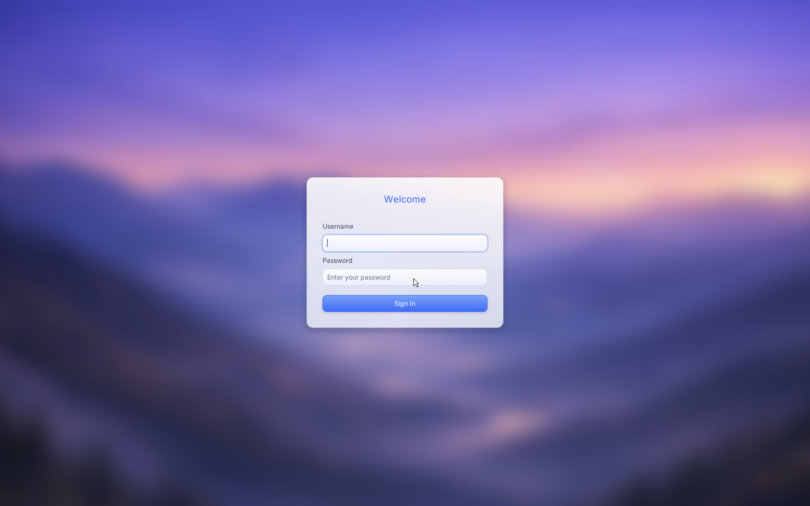
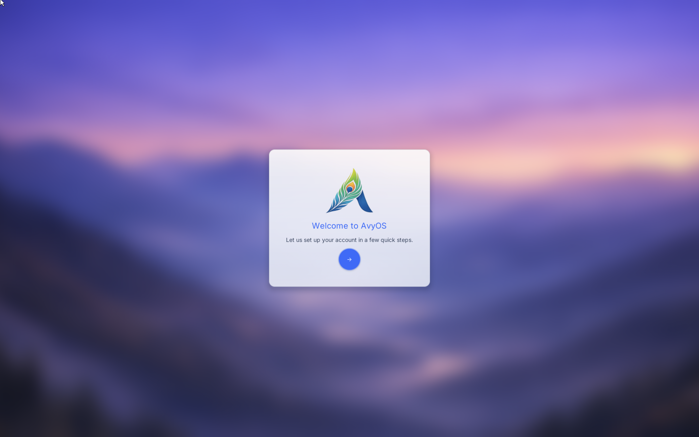
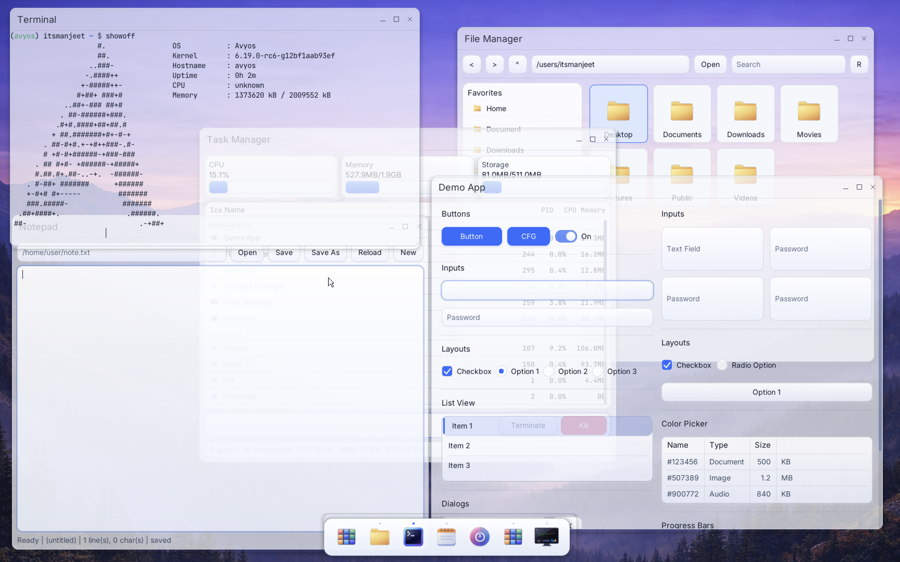
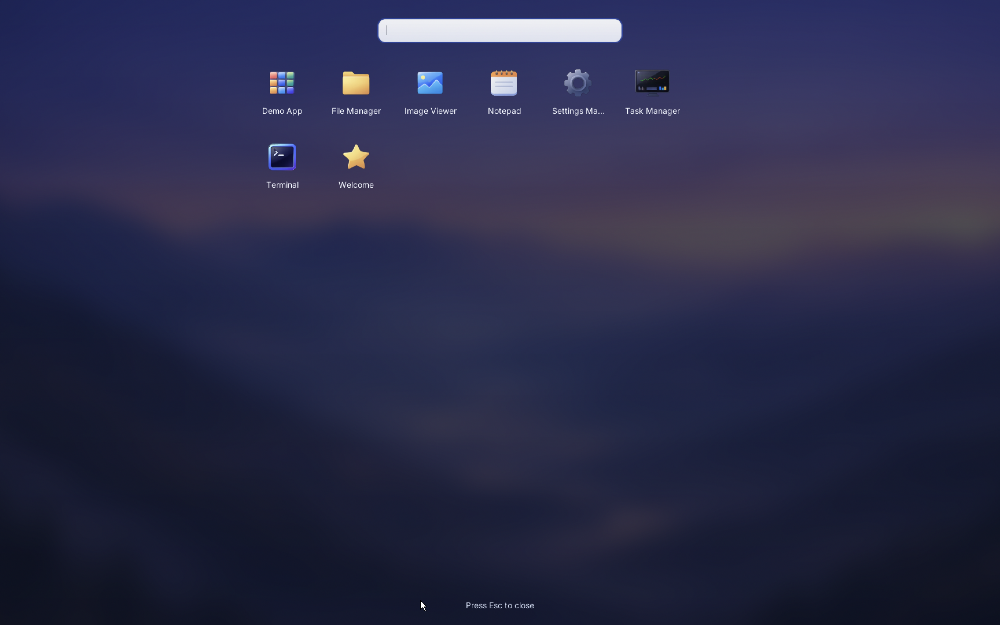
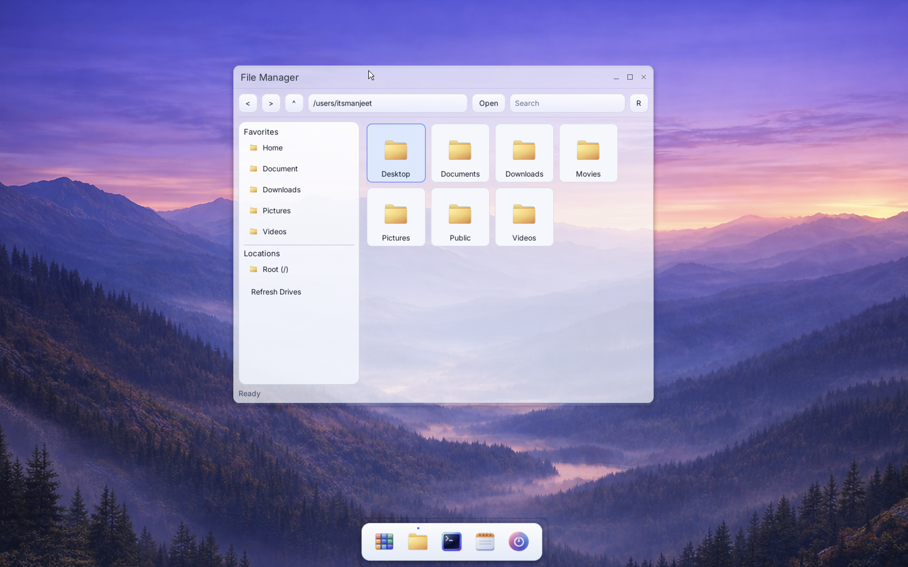

# Desktop Interface

This guide covers the current AvyOS desktop interface and daily navigation model.

## Session overview

A normal session looks like:

1. login screen
2. desktop shell/compositor
3. app menu and pinned applications
4. floating and tiled application windows

## Main UI areas

### Background layer

- provides wallpaper and right-click desktop menu
- exposes quick actions (app menu, terminal, file manager)

### Top-level windowing/compositor

- manages app windows, focus, move/resize behavior
- dispatches keyboard/mouse events to active windows

### Dock and app menu

- dock gives quick launch and task switching
- app menu provides searchable app launch access

## Core interactions

### Open applications

- use app menu
- use dock shortcuts
- use `open` command for file association launches

### Window control

- focus with mouse click
- move/resize using desktop controls provided by compositor
- close/minimize/maximize based on app chrome support

### Keyboard shortcuts

Shortcut availability depends on current app and compositor bindings.

Typical desktop shortcuts include launching app menu, terminal, and window-management actions.

## First-day checklist

After login, validate:

1. display and input are working
2. app menu opens
3. settings app can be launched
4. terminal and file manager open successfully

## Screenshots

Login screen:

Welcome/OOBE screen:

Desktop interface:

App menu:

File manager:

## Notes

Desktop UX is under active development. Behavior and shortcuts may change across revisions.
